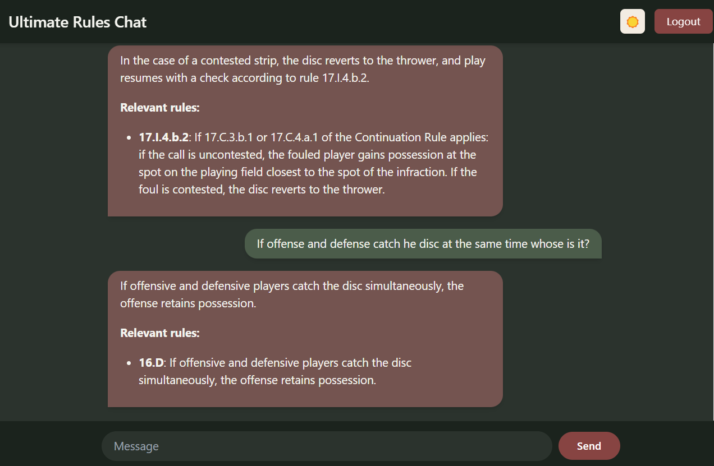

# Ultimate Rules RAG

An AI-powered web application that answers questions about Ultimate rules using RAG (Retrieval Augmented Generation) technology.

## Features

- 🤖 AI-powered chat interface for Ultimate rules questions
- 🔒 Secure user authentication
- 💾 Conversation history storage
- 📱 Responsive, clean UI design
- 🎯 Accurate responses based on official Ultimate rules

## Tech Stack

### Frontend

- React
- Tailwind CSS
- Modern, responsive design

### Backend

- FastAPI (Python)
- RAG implementation for accurate rule retrieval
- JWT authentication

### Database

- PostgreSQL with pgvector for embeddings storage
- Stores user data, conversations, and vectorized rules

## Getting Started

### Prerequisites

- Docker and Docker Compose
- Git

### Installation

1. Clone the repository:
